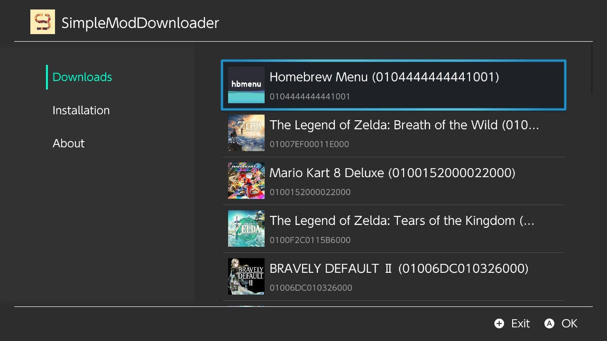
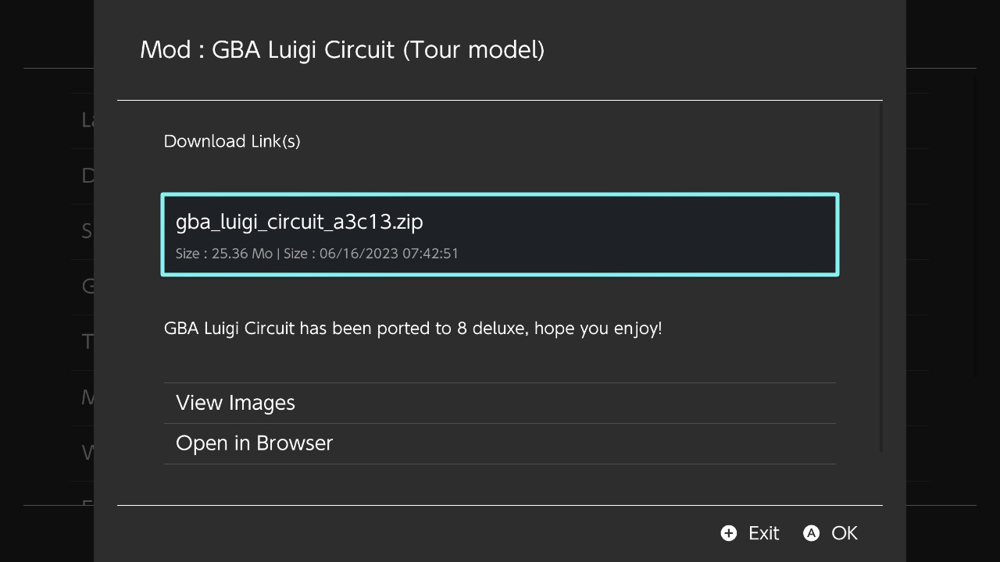
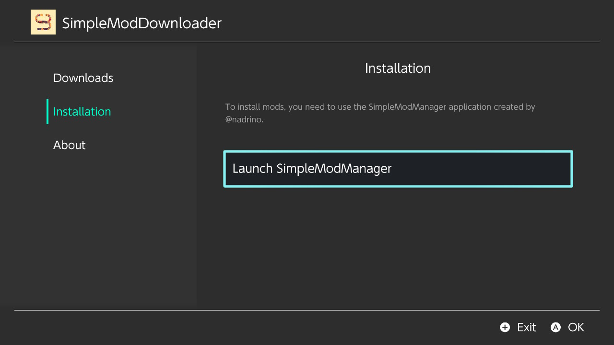

<div align="center">
    <h1>SimpleModDownloader</h1>
    <p>A switch homebrew which downloads mods from gamebanana</p>
</div>

<p align="center">
    <a rel="LICENSE" href="https://github.com/PoloNX/SimpleModDownloader/blob/master/LICENSE">
        
    </a>
    <a rel="VERSION" href="https://github.com/PoloNX/AtmoPackUpdater">
        
    </a>
    <a rel="BUILD" href="https://github.com/PoloNX/SimpleModDownloader/actions">
        
    </a>
</p>

---
  
     

- [Features](#features)
- [Screenshot](#screenshot)
- [How to build](#how-to-build)
- [Help me](#help-me)
- [Credits](#credits)

## Features

- Download mods from gamebanana directly from your switch
- Install mods directly from your switch with [SimpleModManager](https://github.com/nadrino/SimpleModManager)

## Screenshot



<details>
  <summary><b>More Screenshots</b></summary>





</details>

## How to build

### Requirements

- [devkitPro](https://devkitpro.org/wiki/Getting_Started)

### Build

```bash
sudo pacman -S switch-curl switch-zlib switch-glfw switch-mesa switch-glm switch-libarchive  
git clone --recursive https://github.com/PoloNX/SimpleModDownloader/
cd SimpleModDownloader
make
```

## Help me

If you want to help me open an issue when you encounter a bug and a pull request if you have a fix.

## Credits 

- Thanks to [Natinusala](https://github.com/natinusala) and [HamletDuFromage](https://github.com/HamletDuFromage) for [borealis](https://github.com/HamletDuFromage/borealis)
- Thanks to [nadrino](https://github.com/nadrino) for [SimpleModManager](https://github.com/nadrino/SimpleModManager)
- Thanks to [GameBanana](https://gamebanana.com/) for their API
- Thanks to [Pikatsuto](https://github.com/Pikatsuto) for the logo and SuperButterScotch for the typo
- Thanks to [NicholeMattera](https://github.com/NicholeMattera) for [Simple-INI-Parser](https://github.com/NicholeMattera/Simple-INI-Parser)

- Thanks to [JerryWn12](https://github.com/JerryWn12) for chinese translation
- Thanks to [iGlitch](https://github.com/iGlitch)for japanese translation
- Thanks to [ExFabian](https://github.com/ExFabian) for romanian translation
- Thanks to [spkats1](https://github.com/spkats1) and [tsamerman](https://github.com/tsamerman) for greek translation
- Thanks to [pixeldeadlock](https://github.com/pixeldeadlock) for brazilian portuguese translation*
- Thanks to [garobcsi](https://github.com/garobcsi) for hungarian translation


